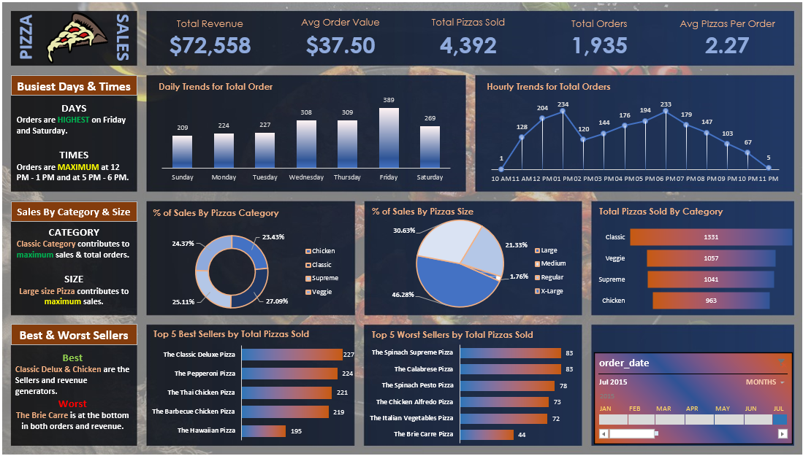

# 🍕 Pizza Sales Data Analysis

Welcome to the Pizza Sales Data Analysis project! This project uses SQL, Excel, and Power BI to explore and analyze pizza sales data, extracting meaningful insights for data-driven decisions. 

## 📋 Table of Contents

- [Project Overview](#project-overview)
- [Data and Tools](#data-and-tools)
- [Steps and Methodology](#steps-and-methodology)
- [Insights and Findings](#insights-and-findings)
- [Visualizations](#visualizations)
- [How to Use this Project](#how-to-use-this-project)

---

## 📝 Project Overview

This project analyzes a dataset of pizza sales with the goal of uncovering trends and patterns. Through data exploration, cleaning, and visualization, I identified actionable insights regarding sales volume, peak sales times, popular pizza types, and revenue trends.

## 💻 Data and Tools

### Data
The dataset used includes transaction-level data for a fictional pizza company, detailing sales across various pizza types, sizes, and times.

### Tools
- **SQL**: Used for data extraction, transformation, and aggregation.
- **Excel**: Assisted in data cleaning, initial exploration, and basic visualizations.
- **Power BI**: Created interactive visualizations and dashboards for deeper insights.

## 🔍 Steps and Methodology

1. **Data Import and Cleaning**
   - Imported the data into SQL and Excel to clean missing values, inconsistencies, and duplicate records.
   - Standardized column names and formats to ensure consistency across analyses.

2. **SQL Analysis**
   - Created SQL queries to:
     - Filter and summarize sales data based on pizza type, size, and topping preferences.
     - Identify peak sales times and busiest days.
     - Calculate total revenue and average order values.
   - Extracted key insights from SQL results, focusing on popular items, customer preferences, and time-based trends.

3. **Excel Analysis**
   - Performed initial visual analysis in Excel with pivot tables and charts.
   - Identified initial patterns in sales distribution, pizza popularity, and sales trends across time.

4. **Power BI Dashboard Creation**
   - Imported the cleaned data into Power BI.
   - Built interactive dashboards showing:
     - Monthly and yearly sales trends.
     - Top-selling pizzas by category.
     - Sales heatmap by day and time.
     - Revenue breakdown by pizza type and size.

## 📊 Insights and Findings

- **Top-selling Pizzas**: The Pepperoni Pizza is the MOST SELLING Pizza.
- **Peak Sales Hours**: Orders are MAXIMUM on Weekends at 12 PM - 1 PM and at 5 PM - 6 PM.
- **Revenue Trends**: Classic Category contributes to maximum sales & total orders.

## 📈 Visualizations

Here are some of the primary visualizations created for this project:

### SQL Query Results
- Add screenshots of any significant SQL queries and their output here.

### Excel Charts
- Insert screenshots of Excel pivot tables or charts that highlight key insights (e.g., popular pizza type by size, monthly sales trend).

   ```markdown
   

### Power BI Dashboard
- Add screenshots of each Power BI dashboard view. Some examples:
  - Sales Overview Dashboard
  - Sales Heatmap by Day/Hour
  - Revenue Breakdown by Pizza Type and Size

To add images to your README:
1. Save your screenshots in the repository folder (create an `images` folder if needed).
2. Use this Markdown code to embed images:

   ```markdown
   

## 🚀 How to Use this Project
1. Clone the repository:
```markdown
!git clone https://github.com/AkashBharangar/Pizza-Sales-Data-Analysis.git

2. Access the data files and SQL scripts provided in the repository.

3. Open the Power BI file (.pbix) to explore the interactive dashboard.

4. Review the insights from the SQL scripts and Excel workbook to understand sales patterns and trends.
